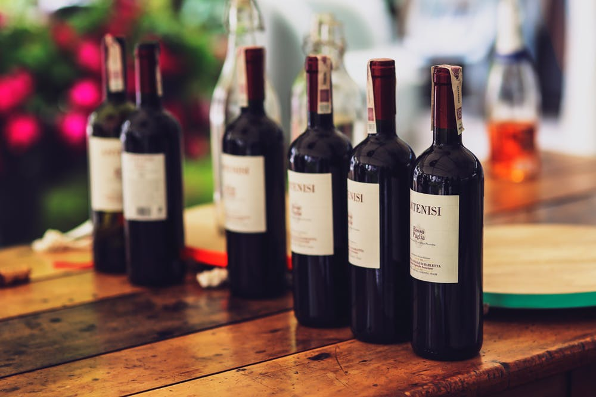

## Portfolio

---

### Data Analytics

### [Greek Yogurt New Flavor Recommendation](/index.md)　　 
[view the code](/files/Greek Yogurt New Flavors Recommendation.html)　　[view the report](/files/Soft Drink Pricing Analysis Report.pdf)   
>**Problem:** found out the optimal set of the next flavors to launch   
>**Approach:** wrote SQL queries to extract, merge sales data and analyze market share of existing flavors; performed preference analysis using survey data; performed TURF analysis to estimate increased customer reach; integrated analysis results to drive decisions; used Tableau for visualization   
>**Outcome:** identified the next flavors to launch; increased customer base by 2%   
>**Tool:** SQL, R, Tableau   

---
### [Toy Horse Product Line Design](/index.md)　　 
[view the code](/files/Greek Yogurt New Flavors Recommendation.html)　　[view the report](/files/Soft Drink Pricing Analysis Report.pdf)   
> **Problem:** designed the most profitable product line    
> **Approach:** conjoint analysis using regression models; cluster analysis based on conjoint part-utilities; market shares simulation for different product-line scenarios; cannibalization and competitive pricing   
> **Outcome:** optimal short-term and long-term product lines; increased profit per year by 91% on average   
> **Tool:** R   

---
### [A/B Testing - Email Campaign Optimization for Wine Retailer](/index.md)　　 
[view the code](/files/Greek Yogurt New Flavors Recommendation.html)　　[view the report](/files/Soft Drink Pricing Analysis Report.pdf)   
> **Problem:**  evaluated the effectiveness of the promotion and who to target with the email campaign    
> **Approach:** A/B Testing randomization check; average casual effect estimate using regression models; slice and dice analysis; individual-level conditional casual effect estimate using casual forest model   
> **Outcome:** confirmed promotion was effective; identified the characteristics of the targeted group to optimize broader campaigns   
> **Tool:** R   

---

### Category Name 2

- [Project 1 Title](http://example.com/)
- [Project 2 Title](http://example.com/)
- [Project 3 Title](http://example.com/)
- [Project 4 Title](http://example.com/)
- [Project 5 Title](http://example.com/)

---

---

